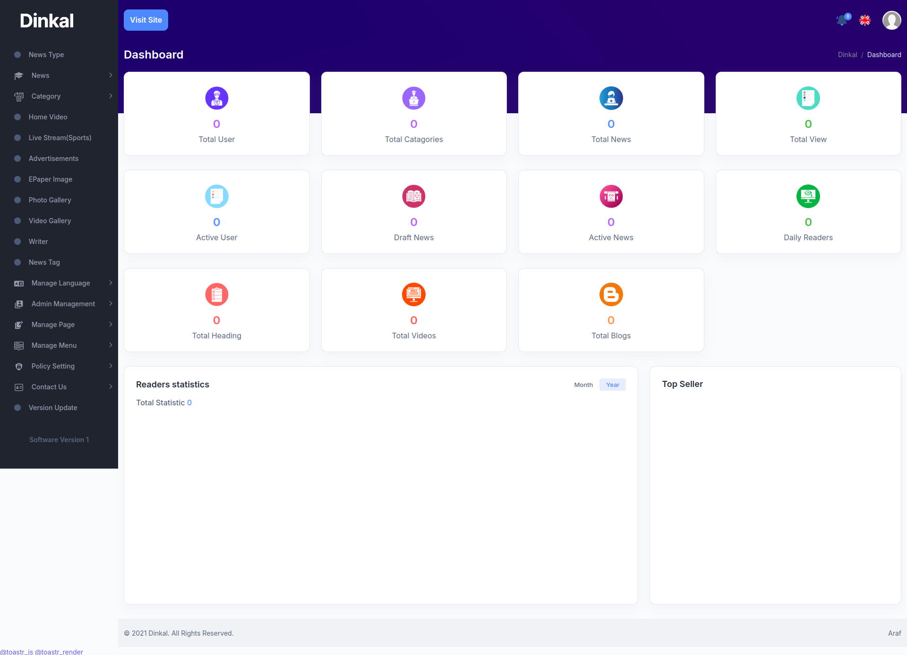

## Server Requirements

- PHP ^8.1

## Steps to install:

# Clone or download the repository.

<h3>Run following commands:</h3>

- run cp .env.example .env.
- php artisan key:generate
- php artisan config:cache
- php artisan migrate:fresh --seed
- npm run dev
- php artisan serve

<h5>Brows this link: http://127.0.0.1:8000/login</h5>
<h3>Admin login credentials:</h3>
- Email: admin@gmail.com
- Password: password

<h1 align="center"></h1>